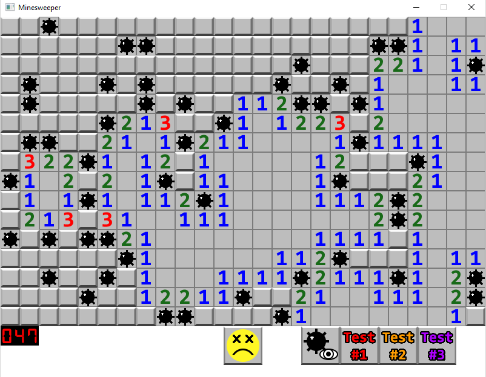

# Minesweeper Clone

This is a Minesweeper clone created in C++ using the SFML library. It closely resembles the original game, featuring optional flags, randomized bombs, a bomb counter, and various test modes for debugging purposes.

## Installation

1. Clone this repository to your local machine or download the source code as a ZIP file.
2. Install the SFML library from https://www.sfml-dev.org/download/sfml/2.5.1/
3. Extract the SFML library files to a directory of your choice.
4. Configure your C++ IDE or editor to link against the SFML library
5. Build and run the project.

## Gameplay

1. Upon launching the game, you will see the Minesweeper game board.
2. Left-click on a cell to reveal its content.
3. Right-click on a cell to place a flag. Right-click again to remove the flag.
4. The numbers on the board indicate the number of bombs adjacent to each cell.
5. Avoid detonating any bombs by carefully revealing cells and using flags to mark suspected bomb locations.
6. Win the game by revealing all non-bomb cells.
7. Restart the game by clicking on the smiley face at the bottom of the screen.

## Testing

- 3 built in test scenarios that can be accessed from the bottom right of the window. 
- Toggle option to hide and unhide mines
